# 简介

一个可怜兮兮还不知道自己唯一使命的Burpsuite插件 (°ー°〃)愣住

此插件会检测所有的GET参数并且进行xss fuzz

注意: 该插件只会在以下几个burp模块运行
- Burp Scanner模块

# 功能

用于检测隐藏的反射XSS

# 安装过程

在安装使用之前,请安装作者的基础转发插件: https://github.com/pmiaowu/BurpHttpForwardRequests

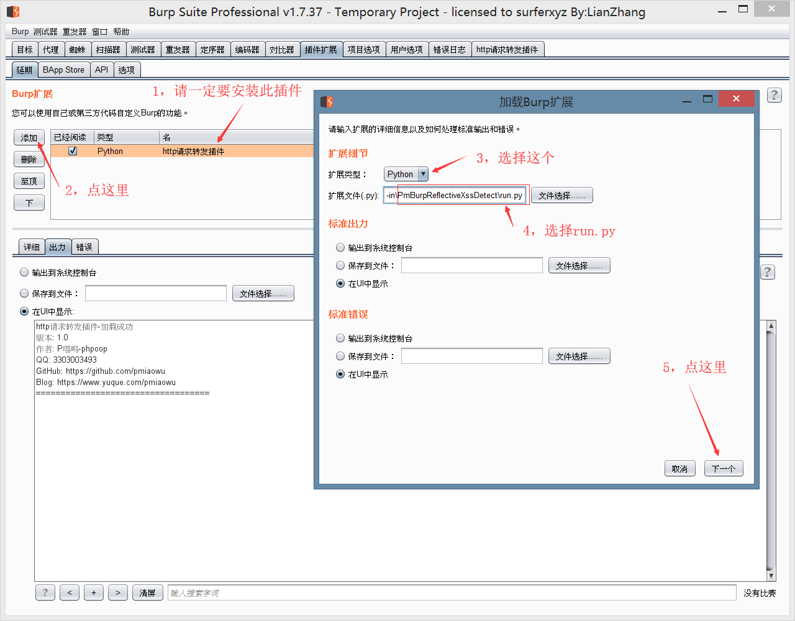
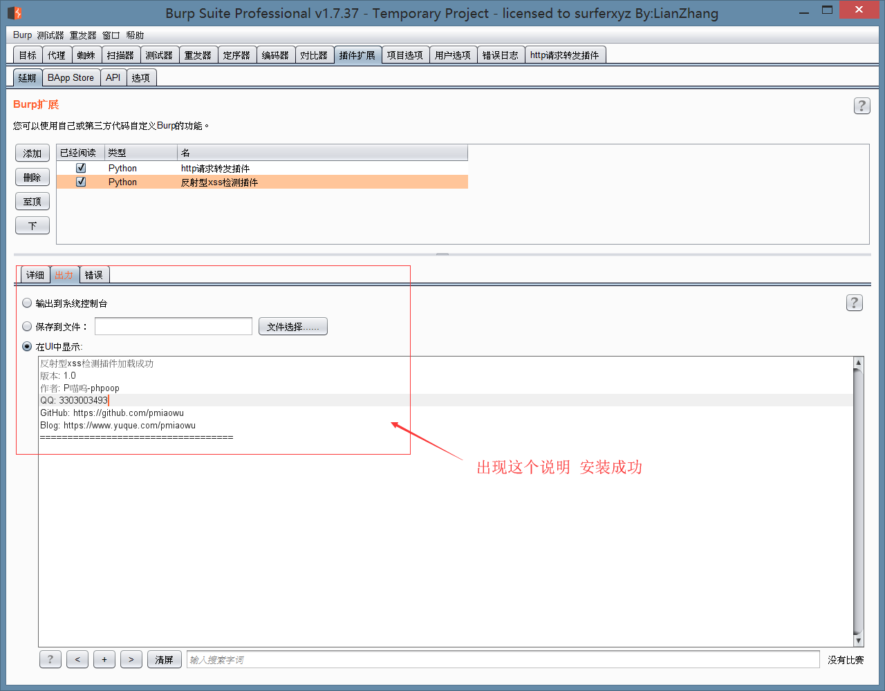

# 配置项

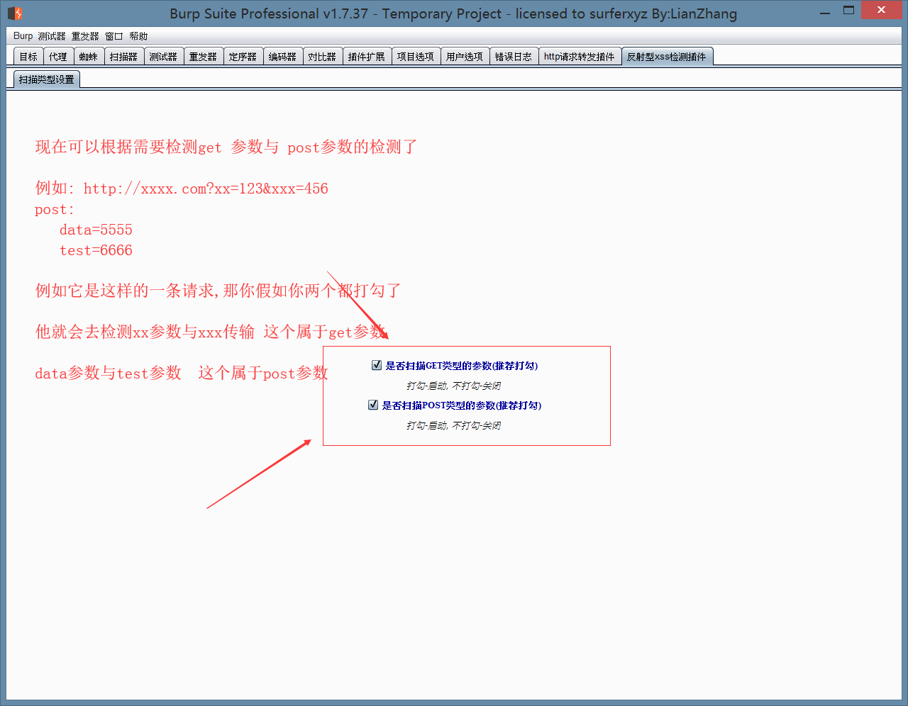

# 测试代码

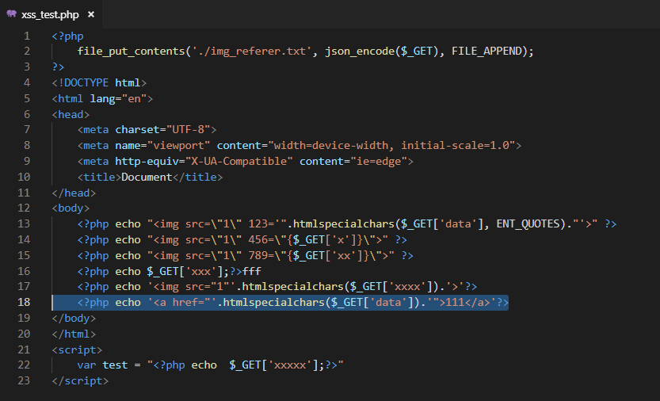

# 运行例子

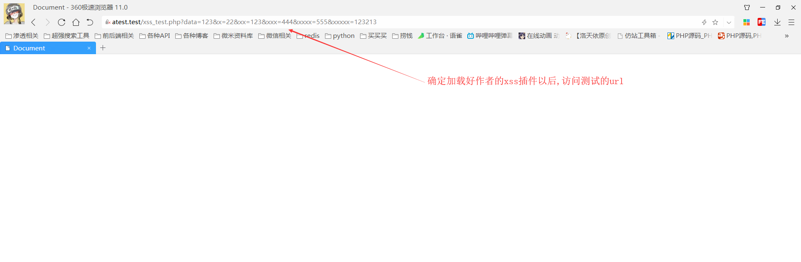
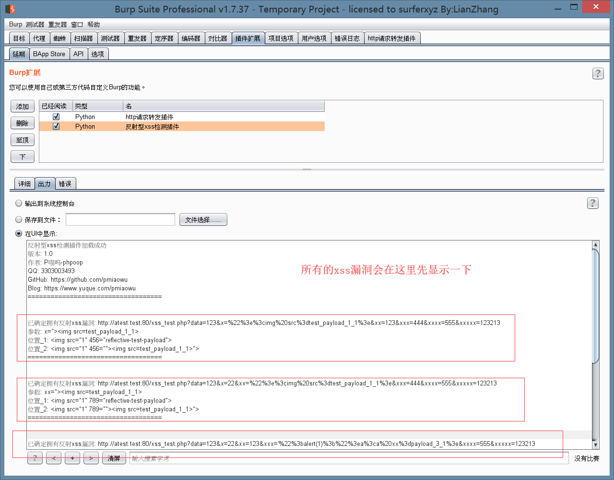
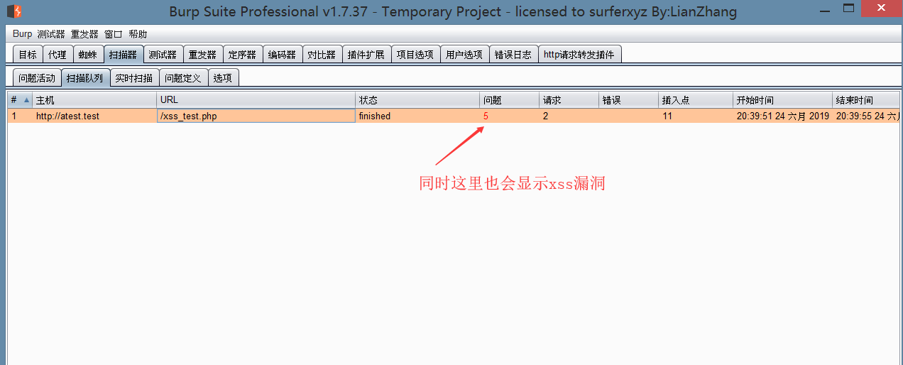
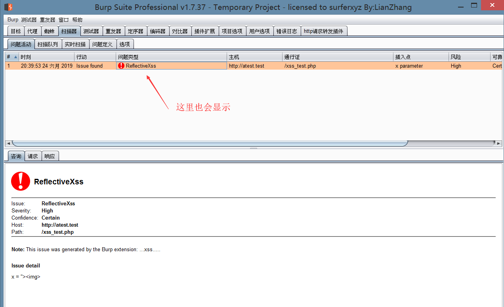
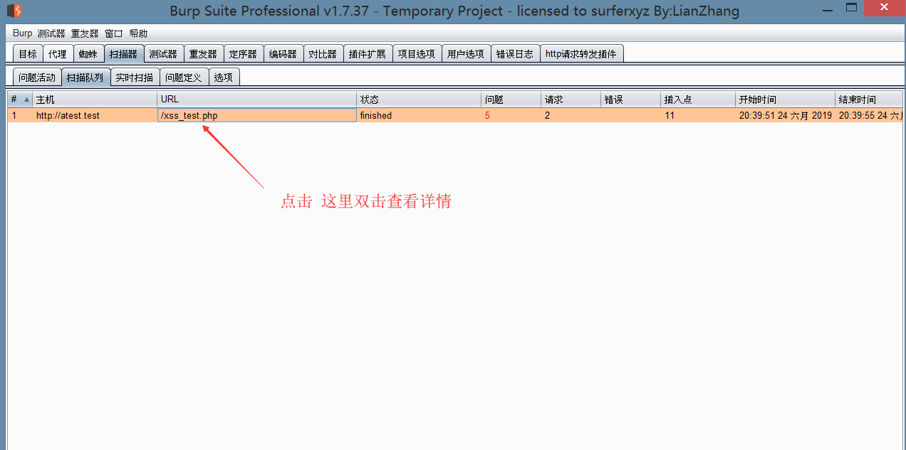
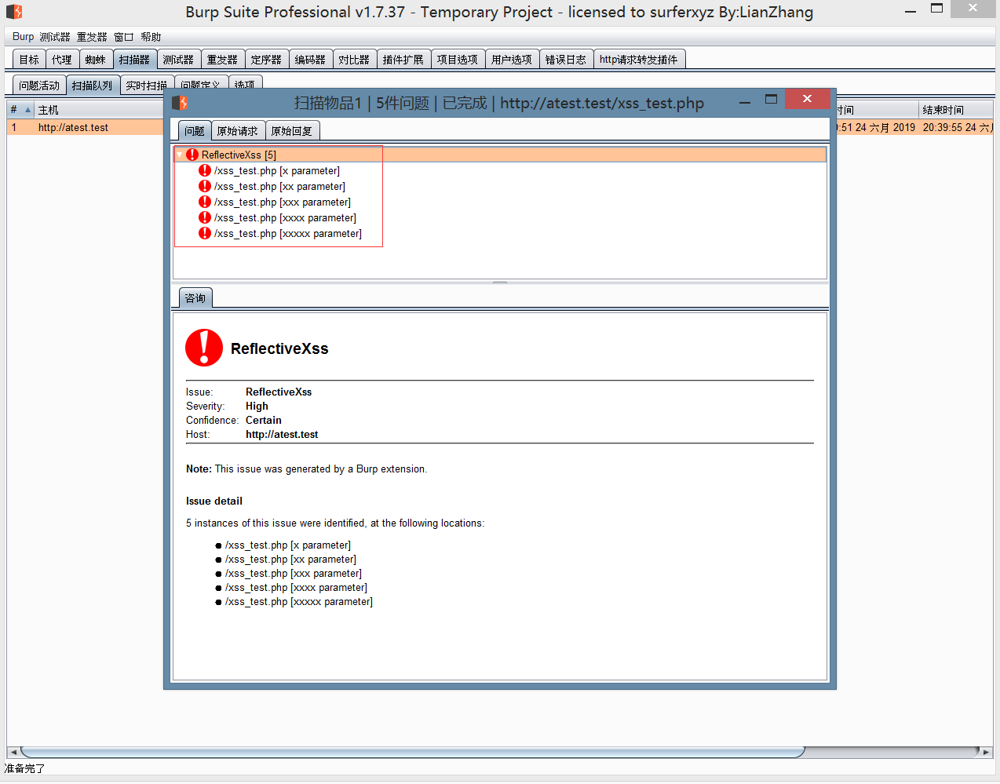

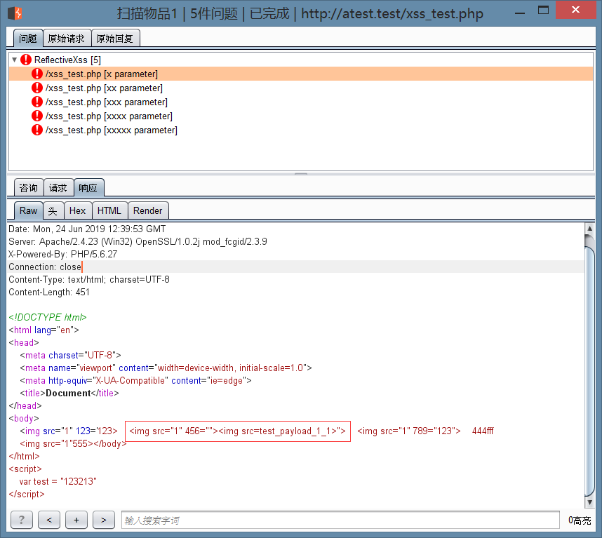